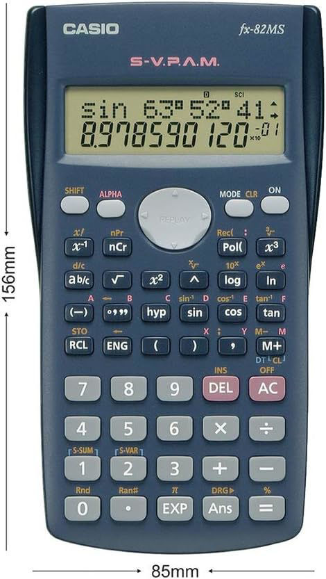
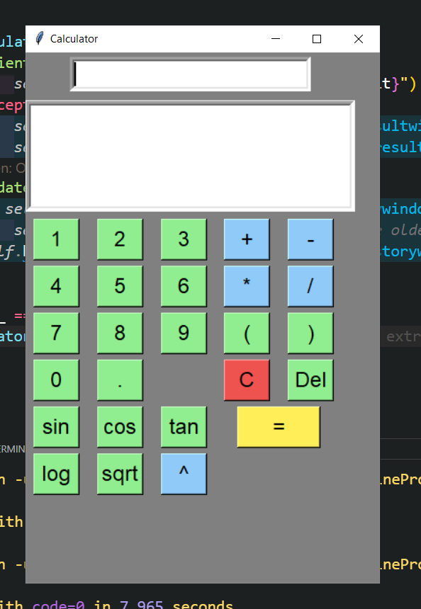

# Calculator

A simple calculator to develop personal project skills - By Daniel Sutton




## Brief

Client "Maderdash" would like a calculator application to be able to calculate when the world is going to end. He must do heavy computations and needs the buttons to respond quickly as he will not have much time to act in coming up with an answer. The world will need a saviour, and he is the man for the job. 

## Requirements

The deliverable version must be provided within 10 days (Friday, May 9th 2025) and it may contain few odd bugs, however the application must be fully functional and stable. Ongoing support must be provided via GitHub issues in order to improve upon the product to ensure the best quality provided.


## Specifications

- C++

- Must simulate a scientific calculator with baseline functionality


### Proposed Technology

- VSCode with C++ Extension
	- Optional: [ZanzyTHEbar/Shunt](https://github.com/ZanzyTHEbar/Shunt)
	- Optional: [Simple and Fast Multimedia Library](https://www.sfml-dev.org/)
- [Dear imGUI](https://github.com/ocornut/imgui)

### Time to deliver

12 days

### Daily planned breakdown (NZT):

```
11 - Tuesday 29th April
		- Project Planning
		- UML Diagram
		- Library Installation & Learning

10 - Wednesday 30th April
		- Class Design
		- Basic Compute Implement

9 - Thursday 1st May
		- Basic Functionality Implement (Core Equation Functions)

8 - Friday 2nd May
		- Functionality Implement (Core Equation Functions)

7 - Saturday 3rd May
		- Functionality Implement (Scientific Functions)

6 - Sunday 4th May
		- Basic Functionality Implement (Scientific Functions)
		- GUI Implement (Dear imGUI Layout)

5 - Monday 5th May
		- GUI Implement (Dear imGUI Callbacks / Output )	

4 - Tuesday 6th May
			- Code cleanup / refactor
			- Reflection
			- Is this the best work I can provide?

3 - Wednesday 7th May
		- Polish
		- Testing
		- Bug Fixing

2 - Thursday 8th May 
		- Testing
		- Bug Fixing
			
1 - Friday 9th May  - Deploy Date
```

